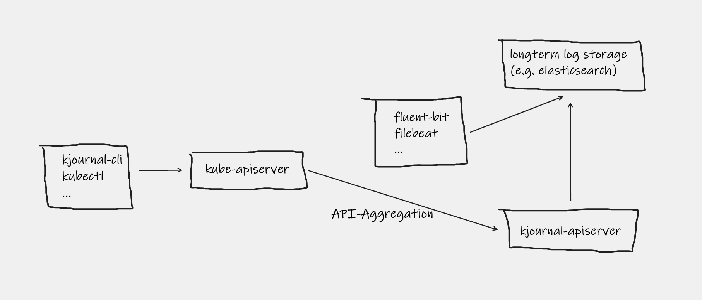

# How it works

kjournal is a kubernetes compatible apiserver. It is meant to run on kubernetes and attached
to the kube core apiserver using the kubernetes api aggregation layer.
Read more about the kubernetes apiserver aggregation [here](https://kubernetes.io/docs/concepts/extend-kubernetes/api-extension/apiserver-aggregation/).

## Logging in kubernetes

### Kubernetes container logs
Kubernetes stores all container logs on the nodes for a limited time. The logs get rotated and logs from older containers
are not accessible at at all and are lost if not persisted elsewhere.

It is commonly known a good practice to gather these container logs and make them available in a longterm log storage.
These logs are then accessible using third party tooling and are out of the kubernetes toolchain.

Read more about the kubernetes [logging architecture](https://kubernetes.io/docs/concepts/cluster-administration/logging/).

### Kubernetes audit logs
The kube-apiserver can be configured to store audit events for all requests going to the apiserver.
Similar to container logs these events are usually stored in log files directly on the master node(s). 
Like for container logs these logs should be persisted into longterm storage to make them available over time.

## Expose longterm logs using kjournal
To close the gap again between the longterm storage and kubernetes is kjournals job. 
The kjournal-apiserver exposes two api groups `container` and `audit` which make the longterm logs accessible
to kubernetes tooling.
The kjournal-apiserver talks to the longterm storage while clients including kjournal or kubectl talk only to the kjournal-apiserver (via the kube-apiserver).

## Limitations
It is **not** the job of kjournal to feed the kubernetes logs into your longterm storage solution.
For this part various tooling exists. The job of kjournal is rather the other way around.